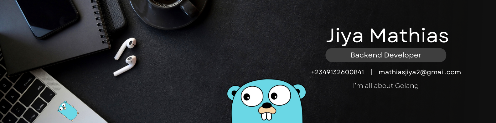

    </img>

<h1 align="center">Hi there , I am <b>Jiya Mathias</b></h1>

    
    

 

👀 Anything Go(Golang)...

📚 I'm opened to collaborate on any Go project

    <h1>Libraries that I manage</h1>
    

    
      
     
      
      
      
    

<h2>Want to get into backend development with Go then this might help you get started</h2>
 

<h1>My stats</h2>

 
  <!--  -->

<h1>How to reach me</h1>
    

    
    
    

<!--  -->
